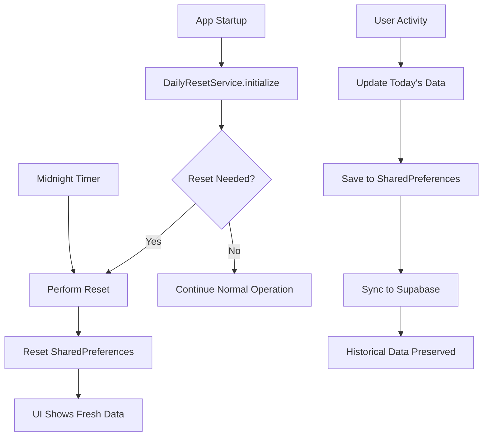

# Daily Data Reset & Persistence System

## Overview
Implemented a comprehensive daily reset system that ensures all user data resets at midnight while preserving historical data in Supabase for analytics and tracking.

## ✅ **How Daily Reset Works**

### **What Resets Daily (UI Shows Fresh Data):**
- **Health Metrics**: Steps, calories burned, heart rate, sleep, distance, water, workouts, weight, blood oxygen, blood pressure, exercise minutes
- **Nutrition Data**: Today's food entries, calories consumed, protein, carbs, fat, fiber
- **Goal Progress**: Daily goal completion percentages and achievement flags
- **UI Progress Bars**: All progress indicators start fresh each day

### **What Persists Forever (Historical Tracking):**
- **Daily Summaries**: Complete daily metrics stored in `user_daily_metrics` table
- **Individual Food Entries**: Detailed nutrition entries in `nutrition_entries` table
- **Streak History**: All streak achievements and patterns
- **Health History**: Historical health data trends
- **User Goals**: Personal targets and preferences

## 🔧 **Implementation Details**

### **1. Daily Reset Service**
**File: `lib/services/daily_reset_service.dart`**

```dart
class DailyResetService {
  // Automatic midnight reset timer
  void _setupMidnightTimer() {
    final now = DateTime.now();
    final nextMidnight = DateTime(now.year, now.month, now.day + 1);
    final timeUntilMidnight = nextMidnight.difference(now);
    
    _midnightTimer = Timer(timeUntilMidnight, () {
      _performDailyReset();
      _setupMidnightTimer(); // Set up next day
    });
  }
}
```

**Features:**
- ✅ **Automatic Detection**: Checks if reset needed on app startup
- ✅ **Midnight Timer**: Automatically resets at 12:00 AM
- ✅ **Persistent Tracking**: Stores last reset date
- ✅ **Manual Reset**: Force reset option for testing
- ✅ **SharedPreferences Reset**: Clears today's cached data

### **2. Enhanced Database Schema**
**File: `supabase_schema.sql`**

#### **Daily Metrics Table (Existing)**:
```sql
CREATE TABLE user_daily_metrics (
  user_id UUID,
  date DATE,
  steps INTEGER,
  calories_consumed INTEGER,
  -- ... all daily metrics
  UNIQUE(user_id, date) -- One record per user per day
);
```

#### **Nutrition Entries Table (NEW)**:
```sql
CREATE TABLE nutrition_entries (
  id UUID PRIMARY KEY,
  user_id UUID,
  food_name VARCHAR(255),
  calories INTEGER,
  protein DECIMAL(6,2),
  carbs DECIMAL(6,2),
  fat DECIMAL(6,2),
  fiber DECIMAL(6,2),
  meal_type VARCHAR(50), -- breakfast, lunch, dinner, snack
  created_at TIMESTAMPTZ
);
```

### **3. Data Flow Architecture**



### **4. Provider Updates**

#### **Health Provider**:
- Uses date-based keys for SharedPreferences
- Loads today's data on startup
- Syncs daily summaries to `user_daily_metrics`

#### **Nutrition Provider**:
- Filters entries by date for "today" view
- Saves individual entries to `nutrition_entries`
- Aggregates today's nutrition for goals

#### **Streak Provider**:
- Uses date-based queries for daily metrics
- Grace period system considers date gaps
- Historical streak data preserved

### **5. Supabase Service Methods**
**File: `lib/services/supabase_service.dart`**

```dart
// Save individual nutrition entries
Future<void> saveNutritionEntry({
  required String userId,
  required String foodName,
  required int calories,
  // ... nutrition data
});

// Get today's nutrition entries
Future<List<Map<String, dynamic>>> getTodayNutritionEntries({
  required String userId,
});

// Get nutrition history (30 days)
Future<List<Map<String, dynamic>>> getNutritionHistory({
  required String userId,
  int days = 30,
});
```

## 🎯 **User Experience**

### **Daily Reset Behavior:**
- **12:00 AM**: All UI counters reset to 0
- **Morning**: User sees fresh goals and progress bars
- **Throughout Day**: Progress accumulates normally
- **Next Day**: Fresh start, but history preserved

### **Data Preservation:**
- **Analytics**: Complete history for trends and insights
- **Achievements**: Streak history and milestones preserved
- **Nutrition History**: Detailed food logging for patterns
- **Health Trends**: Long-term health metric tracking

## 📊 **Database Structure**

### **Daily Summary (user_daily_metrics)**:
```json
{
  "user_id": "uuid",
  "date": "2025-01-15",
  "steps": 10234,
  "calories_consumed": 1850,
  "protein": 85.5,
  "water_glasses": 8,
  "all_goals_achieved": true
}
```

### **Individual Entries (nutrition_entries)**:
```json
[
  {
    "food_name": "Chicken Breast",
    "calories": 165,
    "protein": 31.0,
    "meal_type": "lunch",
    "created_at": "2025-01-15T12:30:00Z"
  }
]
```

## 🚀 **Benefits**

### **User-Friendly:**
- ✅ Clean slate every day motivates users
- ✅ Clear daily progress tracking
- ✅ No confusion with accumulated data
- ✅ Intuitive "today" vs "history" separation

### **Technical:**
- ✅ Automatic midnight reset with timers
- ✅ Robust data persistence in Supabase
- ✅ Historical analytics capabilities
- ✅ Efficient date-based queries
- ✅ Offline capability with SharedPreferences

### **Analytics Ready:**
- ✅ Complete nutrition entry history
- ✅ Daily health metric trends
- ✅ Streak pattern analysis
- ✅ Goal achievement statistics
- ✅ Long-term behavior insights

## 🔄 **Reset Process**

### **App Startup:**
1. DailyResetService checks last reset date
2. If different from today → performs reset
3. Clears SharedPreferences daily keys
4. UI shows fresh counters (0 values)
5. Sets up midnight timer for automatic reset

### **Midnight Auto-Reset:**
1. Timer fires at exactly 12:00 AM
2. Clears today's SharedPreferences
3. Next app interaction shows fresh data
4. Previous day's data safely stored in Supabase

### **Data Persistence:**
1. All user activity saves to both local cache AND Supabase
2. Daily summaries stored in `user_daily_metrics`
3. Individual entries stored in `nutrition_entries`
4. Historical data never deleted

## 🛠 **Implementation Files**

### **New Files:**
- `lib/services/daily_reset_service.dart` - Core reset logic
- `DAILY_RESET_SYSTEM.md` - This documentation

### **Updated Files:**
- `lib/main.dart` - Initialize daily reset service
- `supabase_schema.sql` - Added nutrition_entries table
- `lib/services/supabase_service.dart` - Added nutrition methods

### **Key Features:**
- ✅ Automatic midnight reset
- ✅ Historical data preservation
- ✅ Individual nutrition entry tracking
- ✅ Date-based data separation
- ✅ Offline/online sync capability

The system now provides the perfect balance: **fresh daily motivation** with **comprehensive historical tracking** for analytics and insights!