# 📊 Streaks Module Comprehensive Analysis Report
**Generated**: December 2024
**Module Status**: ❌ **10% Functional** (Major Issues)

---

## 🔍 Executive Summary

The Streaks module has **critical architectural issues**:
1. **Table name mismatch** - App expects `user_streaks`, database has `streaks`
2. **Duplicate models** - Two separate streak models in different providers
3. **Complex dependencies** - Relies on health/nutrition data that isn't syncing
4. **Grace period system** - Advanced feature implemented but unusable

---

## 📁 File Structure Analysis

### Core Files Identified
```
├── models/
│   └── streak_model.dart           # Comprehensive models (UserStreak, UserDailyMetrics)
├── providers/
│   ├── streak_provider.dart        # Main streak provider (uses user_streaks table)
│   └── user_provider.dart          # Has duplicate StreakData class
├── widgets/
│   └── streak_display_widget.dart  # UI component for displaying streaks
└── services/
    ├── supabase_service.dart       # Uses 'streaks' table
    └── enhanced_supabase_service.dart # Has fallback logic for both tables
```

---

## 🔴 Critical Issues Found

### 1. **Database Table Name Mismatch** (🚨 CRITICAL)

**The Problem:**
- Flutter app queries: `user_streaks` table
- Database has: `streaks` table
- **Result**: "Could not find the table 'public.user_streaks' in the schema cache"

**Code Evidence:**
```dart
// streak_provider.dart line 66
.from('user_streaks')  // ❌ This table doesn't exist

// supabase_service.dart line 440
.from('streaks')  // ✅ This is the correct table
```

### 2. **Duplicate Streak Models** (⚠️ MODERATE)

**Two competing models exist:**

| Model | Location | Features | Usage |
|-------|----------|----------|-------|
| `UserStreak` | streak_model.dart | Full-featured with grace period | streak_provider.dart |
| `StreakData` | user_provider.dart | Basic streak tracking | user_provider.dart |

**Issues:**
- Data fragmentation
- Inconsistent state management
- Confusion about source of truth

### 3. **Complex Architecture** (⚠️ MODERATE)

The streak system depends on:
1. **Health metrics** → Not syncing (constraint errors)
2. **Nutrition data** → Partially working
3. **Daily goals** → Need all 5 goals completed for streak
4. **Grace period** → 2-day forgiveness system

**Current flow (broken):**
```
Health Provider →
Nutrition Provider → StreakProvider → user_streaks table (❌ doesn't exist)
User Provider →
```

### 4. **Advanced Features Not Working**

**Implemented but unusable:**
- Grace period system (2 excuse days)
- Perfect weeks/months tracking
- Automatic streak recovery
- Real-time subscriptions
- Daily metrics aggregation

---

## 🛠️ Technology Stack

### Data Models
- `UserDailyMetrics` - Tracks 23 different daily metrics
- `UserStreak` - Manages streak with grace period
- `StreakData` - Simplified duplicate model

### Features Implemented
- ✅ Comprehensive streak calculation
- ✅ Grace period (2 excuse days)
- ✅ Progress tracking (5 daily goals)
- ✅ Achievement badges
- ✅ Real-time updates
- ✅ Local storage fallback

### Database Operations
- **Expected**: `user_streaks` table
- **Actual**: `streaks` table
- **Views**: Attempted compatibility view (not working)

---

## 📊 Data Flow Architecture

```mermaid
graph TD
    UI[streak_display_widget] --> SP[StreakProvider]
    UI -.-> UP[UserProvider/StreakData]

    SP --> UST[user_streaks table ❌]
    SP --> HP[HealthProvider]
    SP --> NP[NutritionProvider]

    SS[SupabaseService] --> ST[streaks table ✅]
    ESS[EnhancedSupabaseService] --> ST
    ESS -.-> UST

    UP --> Local[SharedPreferences]

    style UST fill:#f99,stroke:#900,stroke-width:2px
    style ST fill:#9f9,stroke:#090,stroke-width:2px
```



---

## 🎯 Feature Analysis

### What Should Work
1. **Daily streak tracking** - Count consecutive days
2. **Grace period** - 2 days to recover streak
3. **Goal tracking** - 5 daily goals (steps, calories, sleep, water, nutrition)
4. **Statistics** - Current, longest, total days
5. **Achievements** - Badges for milestones

### What's Actually Working (10%)
- ✅ UI displays (shows 0)
- ✅ Local storage of streak count
- ⚠️ Manual increment (if table existed)
- ❌ Database sync
- ❌ Goal completion tracking
- ❌ Grace period
- ❌ Real-time updates

---

## 🗑️ Junk/Redundant Code

### Files to Clean Up
1. **`StreakData` class in user_provider.dart**
   - Duplicates `UserStreak` functionality
   - Less feature-rich
   - Creates confusion

2. **Database migrator streak logic**
   - Tries to create compatibility view
   - Not properly executed
   - Adds complexity

### Redundant Patterns
```dart
// DUPLICATE 1: user_provider.dart
class StreakData {
  final int currentStreak;
  final int longestStreak;
  // Basic implementation
}

// DUPLICATE 2: streak_model.dart
class UserStreak {
  final int currentStreak;
  final int longestStreak;
  // + 20 more fields with grace period
}
```

---

## 🔧 Why It's Only 10% Functional

1. **Database query fails** → No data loads
2. **Dependencies broken** → Health/nutrition not syncing
3. **Table name mismatch** → Core functionality blocked
4. **Complex requirements** → Need 5/5 goals for streak

**Current State:**
```
App starts → Load streaks → Query user_streaks → ERROR 404 → Show 0
```

---

## ✅ Quick Fix

### Option 1: Fix Table Name (Easiest)
```dart
// streak_provider.dart - Change all occurrences
.from('user_streaks')  // Change to:
.from('streaks')
```

### Option 2: Create Database View
```sql
CREATE VIEW user_streaks AS SELECT * FROM streaks;
```

### Option 3: Rename Database Table
```sql
ALTER TABLE streaks RENAME TO user_streaks;
```

---

## 📋 Recommendations

### Immediate Actions (1 hour)
1. **Fix table name** - Change `user_streaks` to `streaks` in code
2. **Test basic increment** - Verify streak counts update
3. **Remove StreakData** - Use only UserStreak model

### Short-term (2-3 hours)
1. **Fix health metrics sync** - Required for streak calculation
2. **Simplify goal requirements** - Maybe 3/5 goals instead of 5/5
3. **Test grace period** - Ensure 2-day forgiveness works

### Long-term
1. **Consolidate providers** - Single source of truth
2. **Add streak types** - Daily, workout, nutrition separately
3. **Implement achievements** - Badges and rewards
4. **Add notifications** - Remind users to maintain streak

---

## 📈 Performance Impact

| Issue | Current Impact | After Fix |
|-------|---------------|-----------|
| Table name mismatch | Feature completely broken | Fully functional |
| Duplicate models | Memory waste, confusion | Clean architecture |
| Complex dependencies | Cascading failures | Isolated concerns |
| No data syncing | Always shows 0 | Real streak tracking |

---

## ✨ What's Well Designed

Despite issues, the module has:
1. **Sophisticated grace period system** - Well thought out
2. **Comprehensive metrics tracking** - 23 data points
3. **Beautiful UI widget** - Polished display component
4. **Real-time subscriptions** - Modern architecture
5. **Local fallback** - Offline support

---

## 🚀 After Fixes

Once the table name is fixed, users will get:
- ✅ Automatic streak tracking
- ✅ Grace period protection (2 excuse days)
- ✅ Progress visualization
- ✅ Achievement badges
- ✅ Motivational messages
- ✅ Monthly/weekly statistics

---

## 📊 Summary

The Streaks module is **well-designed but critically broken** due to a simple table name mismatch. The architecture is overly complex with duplicate models and heavy dependencies on other broken modules (health/nutrition).

**Quick win**: Change `user_streaks` to `streaks` in `streak_provider.dart` (3 occurrences) to immediately improve functionality from 10% to ~60%.

**Full functionality** requires fixing health metrics sync and nutrition data flow.